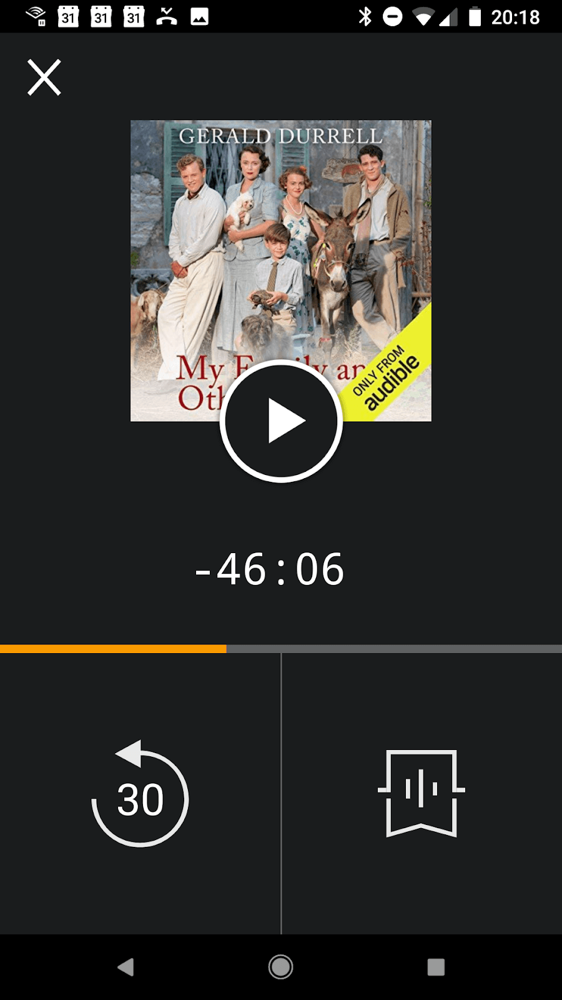
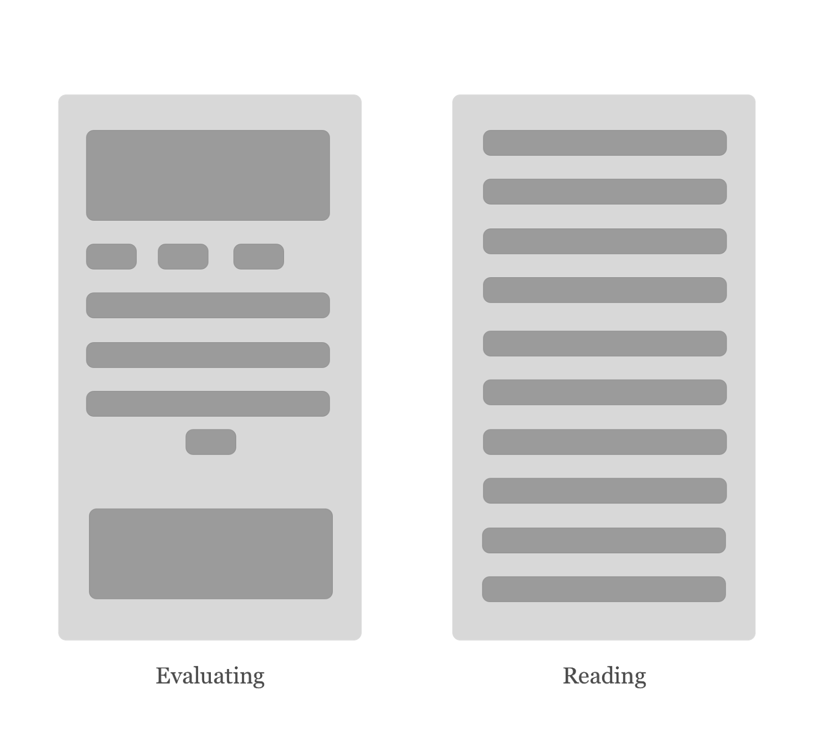
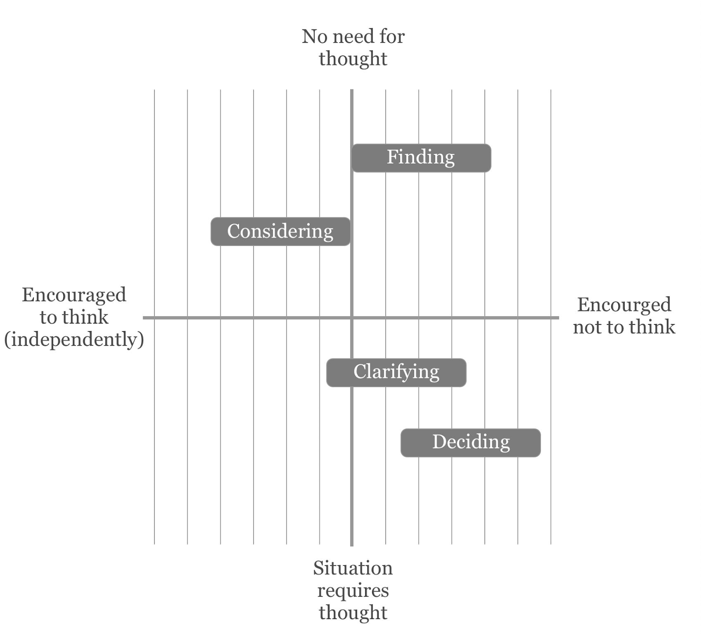
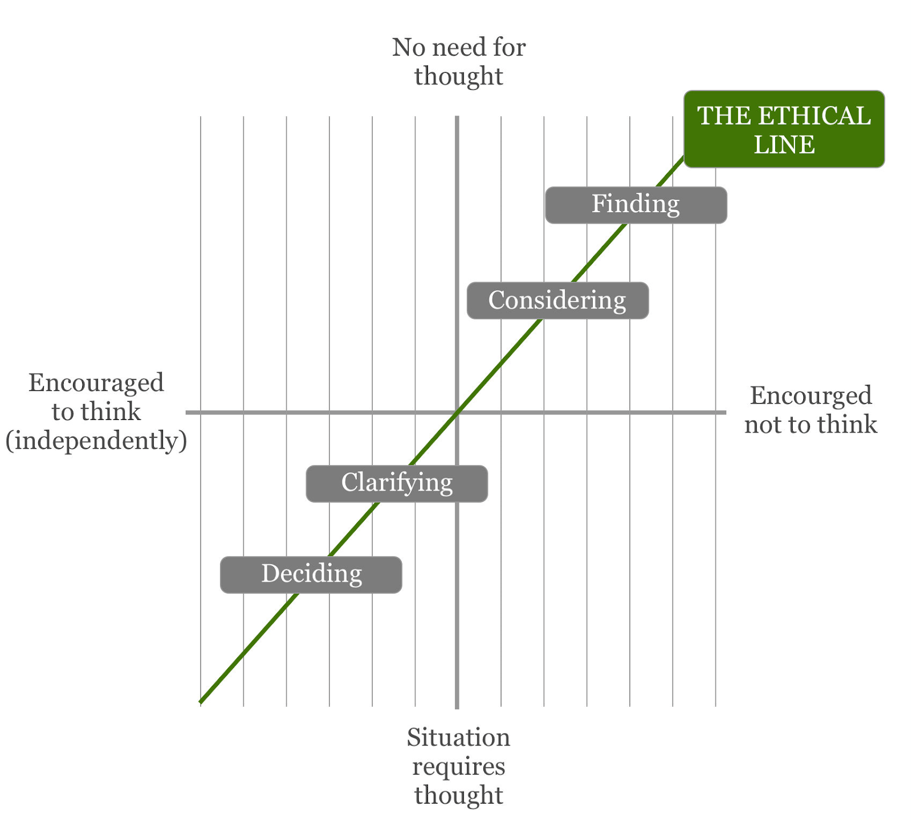
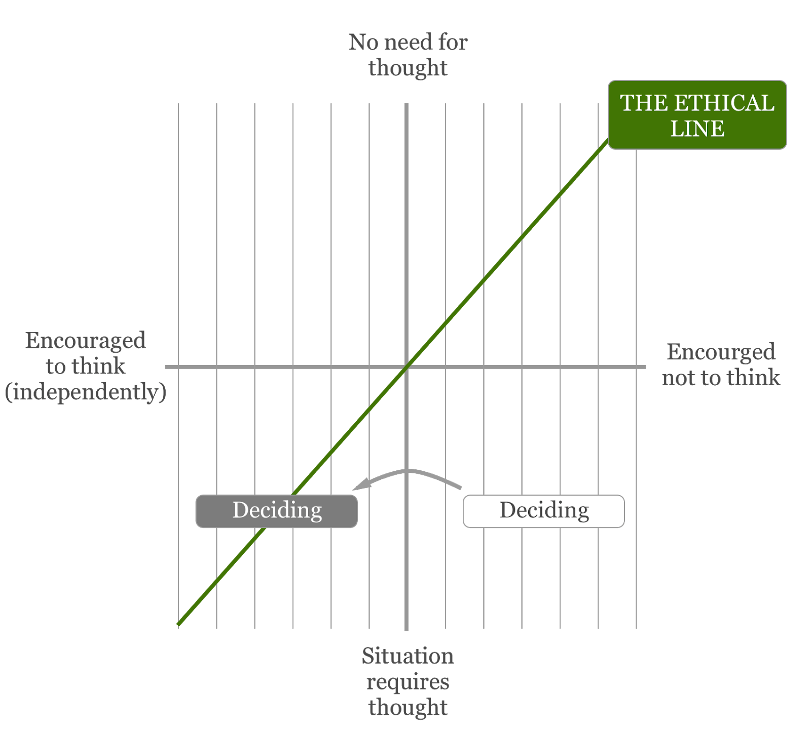
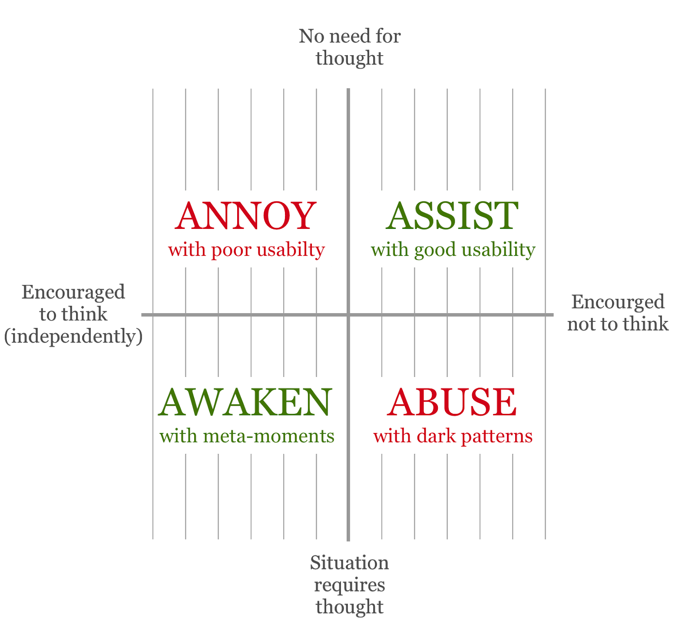
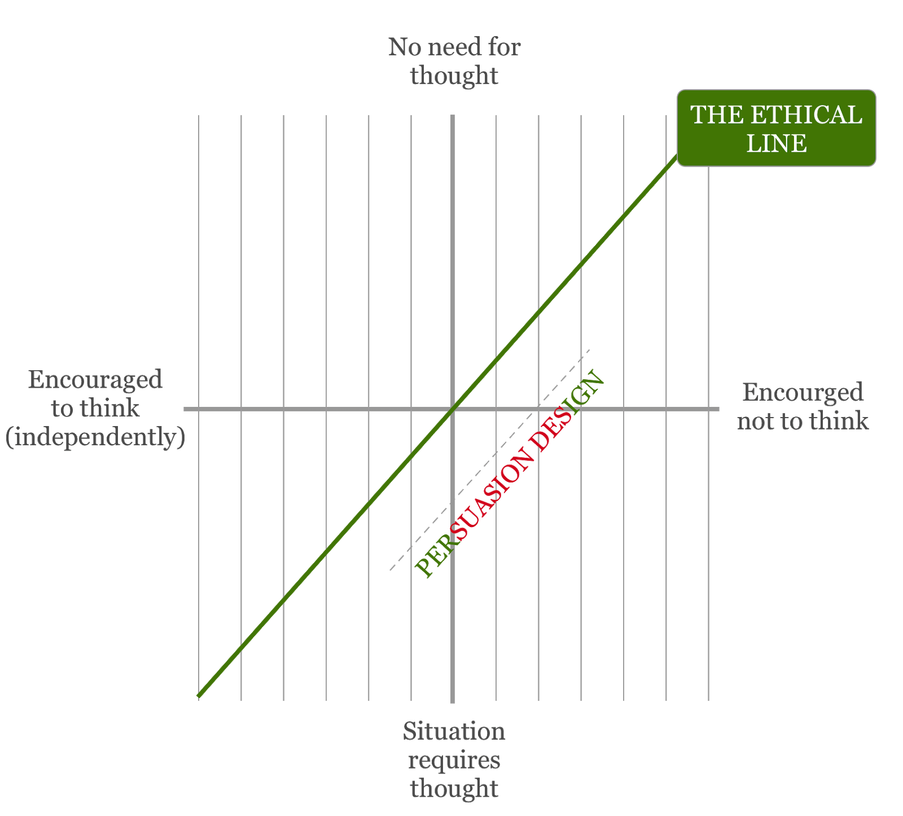

We humans have developed ways of coping with digital interfaces. We have tactics. We accept shortcomings. We make do.

[no comments yet][1] [Become a patron][2]

But why is it still so hard (on most of the internet) to avoid uphill struggles? Often, for example, a quality reading experience is only fully available via a hack, using [Safari’s reader view][3] or a browser plug-in. I use Instapaper to send articles to my Kindle—a device that’s devoted to reading mode—because reading is not just about getting the job done. The experience itself is also important.

The best experiences result from designers matching the way the computer behaves with the way our users are thinking, feeling, and interacting. This is what user experience design is all about. And yet, because of pressures, competing priorities, and industry trends, interaction modes are often an afterthought.

## Prioritizing interaction modes

A while back I created a persona for Cambridge University Press named Rachel Research Gatherer. The Rachel bit, I now understand, was irrelevant ([unhelpful, even][4]). But naming the research gatherer mode helped my team focus on what was needed to support the gathering of scholarly articles and books. The precise ordering and arrangement of citation data, author biographies, metrics, and publication metadata was all organized around this central thought:

_The user is trying to gather research._

This focused our feature set and allowed for deprioritizing functionality related to other, non-essential modes (e.g., reading online—our research gatherers were only interested in saving PDFs to read later).

In fact, the best personas I’ve seen have always included the interaction mode (or dominant behavior) in the title, which encourages a focus on software that supports that way of interacting. Thinking about roles or demographic attributes just isn’t as helpful. Presuming that lots of research gatherers are going to show up, you want them to converse with software that is appropriately trained and has a research gathering mode that can easily be found and switched on. The leap to be made is one from understanding a human behavior to designing its matching counterpart: an appropriate computer behavior. I’ve come to think of interaction modes as aspects of the persona you want your digital product or service to have. They can codify a specific set of behaviors, morals, and manners.

## Moving between modes

In most cases, designers have to account for multiple possible interaction modes and, crucially, the shifts between them.

Some shifts can be explicitly triggered by the user. Take Audible’s driving mode, which helps users stay safe by minimizing potential distractions: it filters out all but three controls and makes the entire upper part of the screen a giant play/pause button.

<picture>
  <source
    type="image/webp"
    srcset="images/a74a6cca360ba39e3fb5f4bb818be82d8325be9318fe3462e492b922568fcb8f_fig1.webp" />

  
</picture>

Fig. 1: Audible’s driving mode.

Driving mode is activated by tapping on a tiny icon, but modes could equally be switched on via a link. If a link took you to “lost or stolen card” on your bank’s website, you might welcome a mode that deals with stressful situations. This might involve an appropriately short quantity of text and guidance—hopefully a quick-fix option (e.g., “freeze my card”) and directions to the nearest human support.

Modes can also shift in response to implied needs. The National Trust—an organization that maintains historic and natural sites across England, Wales, and Northern Ireland—has an app whose visit mode focuses on local events and information relevant to users’ geolocation. This mode is offered to the user when they approach a National Trust property. It’s a safe bet that they’re going to prefer this mode, but they’re offered the choice to activate it anyway. It’s good manners.

There are also times when there is no need to ask. Let’s consider another familiar human-computer interaction: evaluating, a mode in which the human tries to assess the quality or fitness of something, as one might do when comparison shopping for a new laptop. The computer (if trained appropriately) helps by surfacing the right metadata, summary info, reviews, and so on. A bit like research gathering, it’s a mode that might lead to reading mode, in a move from “Shall I read this?” to “I’m reading this!” A well-presented article will start with different content and functional elements than it continues with. The top of this page is all about supporting evaluation mode; then those elements fall away when the user indicates that they’ve shifted into reading mode. They show this intent by, say, scrolling slowly down the page or clicking a “read more” button.

<picture>
  <source
    type="image/webp"
    srcset="images/5def3a8da7d7ee1b2944f9db1363851e5c7fe660a815f3a99d85cb6a4b76f75a_fig2.webp" />

  
</picture>

Fig. 2: Evaluating mode might include the author bio, date, number of comments, classification tags, lead image, and the first paragraph with a “read more” button. Reading mode might include just beautiful text and the occasional supporting image.

The object, in this case an article, looks different, sometimes very different, when supporting different modes. And the user might move between these modes without even registering the shift.

## Interaction modes are computer behaviors

A simple but important distinction to make when thinking about modes:

_Interaction modes are something the software does, not something the user does; “reading” is just a shorthand for “reading mode.”_

This distinction is critical, because it allows us to be so much more precise about the behavior of the components in a design system. We don’t always need to rely on individual interpretation of personae or journey maps, or remember an agreed set of design principles. We can, instead, bake our values into our modes. We can, for example, name components according to the mode they’re intended to support rather than just to create more purposeful and consistent designs (though these are great things to aim for).

Interaction modes also offer us a design tool that can help tame our technology, giving it manners that work in a variety of contexts. And in our world of agentive AI, chatbottery, and algorithms, getting a grip on this conduct is becoming increasingly important.

## Two moral questions

As time goes on, we have more and more powerful controls available to us in fast digital mediums. There’s an increasing need to recognize that poor usability is not the only factor to watch out for. We need to be working design ethics into our decision making.

It could start with a simple moral question for design teams: how much are you going to help your users interact in the way that they would prefer? If they’re reading, how many ads (or other distractions) are you going to throw in their faces? Even though users might prefer ads to paying for content, there are better and worse ways to show people ads. Deliberately designing for a reading mode will give you a better shot at reconciling this conflict in a good way, allowing you to create the best reading space possible within the constraints. Compromises would become more deliberate and (hopefully) less damaging.

A second, less obvious, moral question is this: when should we use design to encourage a more appropriate way of interacting than the user’s default? In my article about [meta-moments][5], I looked at some ways to slow the user’s experience (using roadblocks, speed bumps, or diversions in the design) when thoughtfulness is needed. The user could be agreeing to give a third party access to their data. Or they might be remortgaging their house. On these kinds of occasions, it’s right to encourage a slower, more attentive mode.

One way to approach this question is to capture the interaction modes that your users want or need, on a chart like this:

<picture>
  <source
    type="image/webp"
    srcset="images/56b7caca98970bb668146617d5ca349238aa4841fef9cc4119a7b4dfa4a218b5_fig3.webp" />

  
</picture>

[Fig. 3 detailed description][6]

To start off, this could just be an expert-led evaluation or a group [forced ranking][7] exercise along the following lines:

1.  Generate a list of interaction modes. Words ending in “-ing” can be useful.
2.  Score for how much thoughtfulness is currently required.
3.  Score for how much thoughtfulness is currently encouraged.
4.  Get charting.

Ideally, you want all your modes to fall close to a diagonal line that stretches from top right to bottom left of your chart. The amount of thoughtfulness we encourage (or leave space for) in each mode would then be roughly in proportion to the amount of thought required.

<picture>
  <source
    type="image/webp"
    srcset="images/2b7a07bd39d4e04730fcf726873c78e680d31cb353f84dbca28dd6058e03ceeb_fig4.webp" />

  
</picture>

[Fig. 4 detailed description][8]

This ethical line makes it look a little like there is only one way to get things right: precisely x amount of thought required = x amount of thought encouraged. It’s hard (and maybe impossible) to measure such things precisely, but that shouldn’t put us off, considering the relative needs in play. If nothing else, the visualization reminds us that there are many more ways to get design wrong than to get it right.

If you find the interaction modes you’re currently supporting don’t fall on the ethical line, you’ll want to move them with your team’s next design effort.

<picture>
  <source
    type="image/webp"
    srcset="images/06b37cc937ba6dd120379955ed27782a6f176f746979bd2c2e63080d089d0be0_fig5.webp" />

  
</picture>

[Fig. 5 detailed description][9]

Ultimately, deciding where to move interaction modes requires a degree of honest reflection and the willingness to shift any annoying or abusive experiences toward assisting or awakening ones.

<picture>
  <source
    type="image/webp"
    srcset="images/ceb64518de09a640e231425a54d54e43de91586f2f5e1b18f9ed24e3400757b4_fig6.webp" />

  
</picture>

[Fig. 6 detailed description][10]

While most designers want to assist and awaken (and avoid abusing or annoying) our users, even a small team will have disagreements about the right path to take. And powerful drivers outside the team, from business models to technology trends, heavily influence design decisions. These factors need our greatest focus if we are to resist following zombie patterns (“our competitors have introduced sexy new feature X so we’d better do it too”) or the tendency to pander (often in the name of UX) to short-term interests. You might be rightly proud of being able to offer a current account opening experience that only takes [minutes][11], but are you sure that this is right for everyone you’re offering it to? Don’t some folks need some extra guidance around how to configure things? Don’t people need to understand the commitments they’re making?

Adding this kind of consideration to the design process can pull against the push for speed and help designers resist the deployment of persuasion techniques in inappropriate contexts.

## Where to draw the line

But how can we know which techniques are inappropriate? It can be hard to make a call on this. For example, testimonials and reviews can help reassure the user and build trust. They _could_ also discourage independent research, but they’re hardly an abusive play.

<picture>
  <source
    type="image/webp"
    srcset="images/1b9084139d24eef22184bea12f7a963536d627a8daaa2e5288c53feeeded1ab7_fig7.webp" />

  
</picture>

[Fig. 7 detailed description][12]

Someone might want to place a pop-up ad directly in the middle of your user’s reading experience, arguing that it is encouraging thoughtfulness about a product that would be in the user’s long-term interests to know about in that context. And they might be right.

For me, this is where good research comes in. We need to know the contexts for which more thoughtful engagement is appropriate to help our users achieve their long-term goals. We have to test our designs for whether they deliver comprehension and fair outcomes over a long timeframe. Only then can we know which of our nudges fall on the ethical line.

## Getting over your squeamishness

You might feel squeamish about defining your users’ best interests for them. How do we dare to presume? Shouldn’t we just lay the facts and choices out there, and let people make all the decisions themselves?

I think there are two solid reasons for getting over this squeamishness. First, design decisions have moral consequences whether you intend them or not. As Tristan Harris puts it, “[If you control the menu, you control the choices.][13]” It is better, therefore, to make your decisions with some deliberateness and transparency.

Second, people are not as individual as we like to think we are. There are common misconceptions that lead to poor choices. To support choosing the right mortgage, for example, designers might reasonably seek out the things that typically trip people up (and are important to know). We need to convey the mechanics of the product: how the interest gets calculated, where fees and charges might come into play, and so on. We do this so we can be sure that the user knows their commitments and that they have the best possible chance of selecting something that meets their long-term needs.

## Bringing dark patterns into the light

To help prioritize these considerations, you might add an understanding or clarifying mode to your chart. Just adding it to the chart will help get _designing for comprehension_ on the agenda. Making space for this conversation will help force dark patterns into the light. Where things are less clear-cut, we might at least acknowledge the need for further research to help add in richer consideration of users and their needs.

Does the internet ever stop you in your tracks? Does it sometimes make you pause and think about what you’re doing? Andrew…

Brandon Gregory considers how to design accessibly for cognitive differences like anxiety disorders, inattention, and depression.

## [The Psychology of Design][14]

Jon Yablonski explains three key theories of psychology that designers can use to build more intuitive, human-centered products.

**Get our latest articles in your inbox.** [Sign up for email alerts][15].

[1]: https://alistapart.com/article/designing-for-interaction-modes#comments
[2]: https://www.patreon.com/alistapart
[3]: https://www.howtogeek.com/326430/how-to-automatically-open-articles-in-safaris-reader-mode/
[4]: https://medium.com/@indiyoung/describing-personas-af992e3fc527
[5]: https://alistapart.com/article/meta-moments-thoughtfulness-by-design
[6]: https://alistapart.com/article/designing-for-interaction-modes#note1
[7]: http://gamestorming.com/350/
[8]: https://alistapart.com/article/designing-for-interaction-modes#note2
[9]: https://alistapart.com/article/designing-for-interaction-modes#note3
[10]: https://alistapart.com/article/designing-for-interaction-modes#note4
[11]: https://www.starlingbank.com/open-bank-account-online
[12]: https://alistapart.com/article/designing-for-interaction-modes#note5
[13]: http://www.tristanharris.com/2016/05/how-technology-hijacks-peoples-minds%e2%80%8a-%e2%80%8afrom-a-magician-and-googles-design-ethicist/
[14]: https://alistapart.com/article/psychology-of-design
[15]: https://alistapart.com/email-signup

